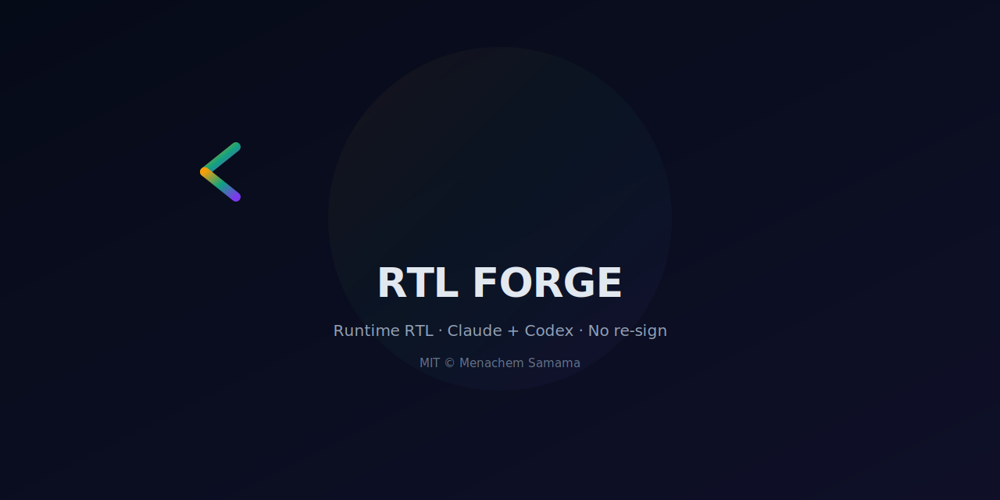
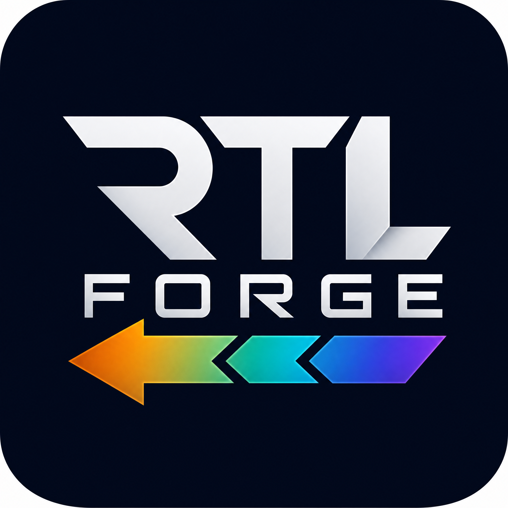

<p align="center">
  
</p>

<hr/>

<p align="center">
  <strong>Runtime RTL for Claude Desktop + Codex on macOS.</strong><br/>
  Official apps. Signatures intact. No copy, no patch, no re-sign.
</p>

<p align="center">
  <a href="docs/README.he-official-runtime.md">עברית</a> ·
  <a href="docs/CODEX.md">Codex guide</a> ·
  <a href="docs/CLAUDE_FOR_OPEN_SOURCE_APPLICATION_DRAFT.md">OSS application</a> ·
  <a href="docs/OWNERSHIP.md">Ownership</a>
</p>

<hr/>

## Status

| App | Signature | Method | Status |
|---|---|---|---|
| **Claude Desktop** macOS | Anthropic `Q6L2SF6YDW` | Transient Developer-debugger runtime inject | ✅ Supported |
| **Codex Desktop** macOS | OpenAI `2DC432GLL2` | Opt‑in relaunch + CDP runtime inject | ✅ Supported |
| Hermes Desktop macOS | ad‑hoc | Deferred — prefer source‑level fix | 🔮 Research |

## Quick start

```bash
git clone https://github.com/Menachem138/rtl-forge.git
cd rtl-forge
npm test
npm run build
```

### Claude

```bash
npm run official:launch
npm run official:watch   # auto‑re‑apply after relaunch / update
```

Grant **Accessibility** once: *System Settings → Privacy & Security → Accessibility*.

### Codex

```bash
npm run codex:apply
```

Relauches Codex with a **local** debug port for this session.  Signature stays OpenAI's.

## How it works

<p align="center">
  
</p>

1. Verify the target app is signed by its official Team ID
2. Open a temporary local debug connection (Claude → built‑in inspector · Codex → Chromium CDP)
3. Inject `payload-v2` — a **layout‑only** RTL engine
4. Close the connection (Claude) or leave the port local (Codex)

## payload‑v2

| Principle | What it means |
|---|---|
| CSS `unicode‑bidi: plaintext` | Primary prose direction — each block self‑determines |
| Selective `dir` | Tables / lists / blockquotes only |
| No text‑node mutation | Copy‑paste &amp; Ctrl‑F return byte‑for‑byte truth |
| No U+200E / U+200F | Zero bidi control‑character injection |
| Composers + xterm safe | Hard no‑touch for ProseMirror editors &amp; Claude Code terminals |

Contract: [payload‑v2/CONTRACT.md](payload‑v2/CONTRACT.md)

## Security model

- Verify Team ID before injection
- Loop‑back only (`127.0.0.1`)
- No chat‑content exfiltration
- No permanent persistence on disk
- Inspector closed immediately after Claude inject; Codex debug port stays local for the session

→ [SECURITY.md](SECURITY.md) · [docs/IP_AND_PROTECTION.md](docs/IP_AND_PROTECTION.md)

## Project layout

```
assets/             banner + logo + social preview
official‑runtime/   macOS launchers, ensure, watchdog, generic Electron CDP injector
payload‑v2/         original layout‑only RTL engine
manager/            menu‑bar helpers + adapter inventory
docs/               guides, IP notes, OSS draft
```

## Development

```bash
npm test
npm run build
npm run official:ensure     # Claude force re‑apply
npm run codex:apply         # Codex relaunch + inject
```

## Claude for Open Source

This project was submitted for the [Claude for Open Source](https://claude.com/contact-sales/claude‑for‑oss) program.  See the [application draft](docs/CLAUDE_FOR_OPEN_SOURCE_APPLICATION_DRAFT.md).

## License

MIT © Menachem Samama — [LICENSE](LICENSE) · [NOTICE](NOTICE)

<p align="center">
  
</p>
