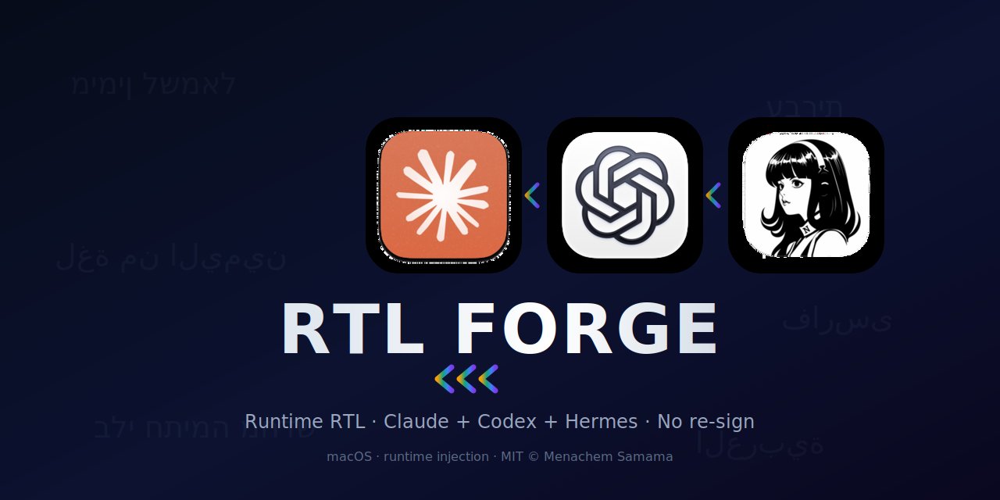

<p align="center">
  
</p>

# Desktop RTL Runtime

**Author:** Menachem Samama · **License:** MIT · **Platform:** macOS

Right-to-left Hebrew, Arabic, and Persian for **official desktop AI apps** — without copying, patching, unpacking, or re-signing them.

| App | How | Status |
|---|---|---|
| **Claude Desktop** | Official Anthropic-signed app · Developer-debugger runtime inject | **Supported** |
| **Codex Desktop** | Official OpenAI-signed app · opt-in CDP runtime inject | **Supported** |
| Hermes Desktop | Prefer source-level fix | Later / research |

> עברית: [docs/README.he-official-runtime.md](docs/README.he-official-runtime.md)

## Why this is a breakthrough

Most RTL “fixes” for desktop AI clients:

1. **Copy** the app → `Something-RTL.app`
2. Patch asar / inject files
3. **Re-sign** ad-hoc

On macOS that often breaks Team-ID / Keychain identity (subscription, Cowork, account surfaces).

This project keeps the **real signed apps** and applies RTL at **runtime**:

- **Claude:** temporary main-process debugger → inject payload → close inspector  
- **Codex:** relaunch with local Chromium debug port → inject **generic** payload-v2 → no re-sign  

Codex is not a “maybe someday” idea: live verification showed Hebrew chat markdown + sidebar titles flipping RTL with the official signed binary intact.

## Quick start — Claude

```bash
git clone https://github.com/Menachem138/desktop-rtl-runtime.git
cd desktop-rtl-runtime
npm test
npm run build
npm run official:launch
npm run official:watch   # optional re-apply after Claude relaunch/update
```

Grant Accessibility once if needed:

```text
System Settings → Privacy & Security → Accessibility
```

## Quick start — Codex

```bash
npm run build
npm run codex:apply
```

This **relaunches** Codex with a local debug port (`127.0.0.1`) for the session, then injects the same `payload-v2` in generic mode. Signature stays OpenAI’s.

Details: [docs/CODEX.md](docs/CODEX.md)

## How Claude inject works

1. Verify Team ID `Q6L2SF6YDW`
2. Enable Developer menu
3. `Developer → Enable Main Process Debugger`
4. Connect `127.0.0.1:9229`
5. Inject `dist/payload.js` from `payload-v2/`
6. Close inspector

## Security model

- No modification of Claude.app / Codex.app on disk  
- No re-sign  
- Loopback only  
- No chat telemetry  
- Inspectors closed after Claude inject (Codex keeps session debug port by design — local only)  

See [SECURITY.md](SECURITY.md) · [docs/IP_AND_PROTECTION.md](docs/IP_AND_PROTECTION.md)

## payload-v2 (original)

- CSS `unicode-bidi: plaintext`  
- Selective `dir`  
- **Never mutates text nodes**  
- No U+200E/U+200F  
- Composer + xterm hard no-touch  

## Project layout

```text
assets/             # banner + logo
official-runtime/   # Claude + generic Electron injectors
payload-v2/         # original layout-only engine
manager/            # adapters + control helpers
docs/               # guides, IP notes, OSS draft
```

## Development

```bash
npm test
npm run build
npm run official:ensure
npm run codex:apply
```

## Claude for Open Source

[docs/CLAUDE_FOR_OPEN_SOURCE_APPLICATION_DRAFT.md](docs/CLAUDE_FOR_OPEN_SOURCE_APPLICATION_DRAFT.md)

## License

MIT © Menachem Samama — [LICENSE](LICENSE) · [NOTICE](NOTICE)

<p align="center">
  
</p>
